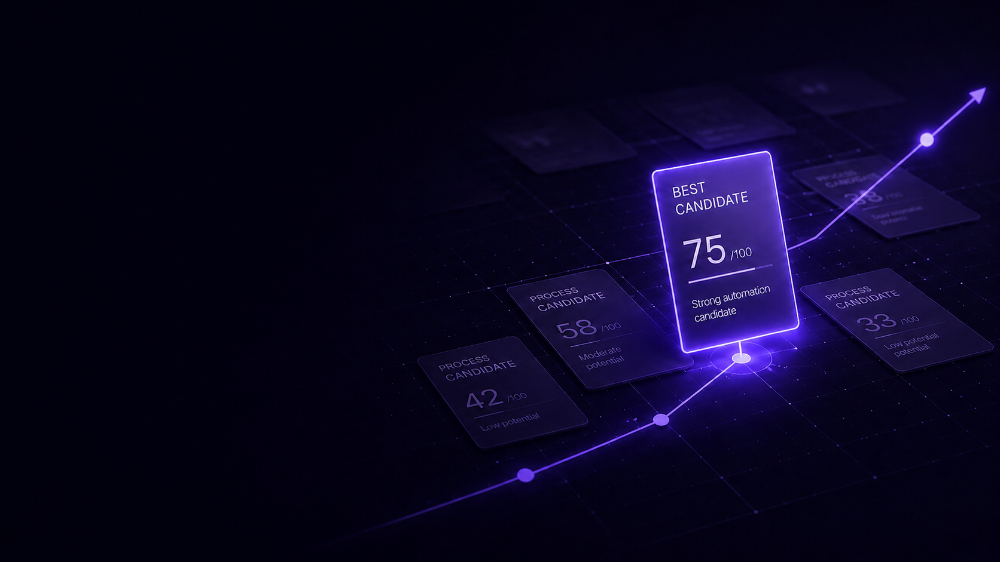
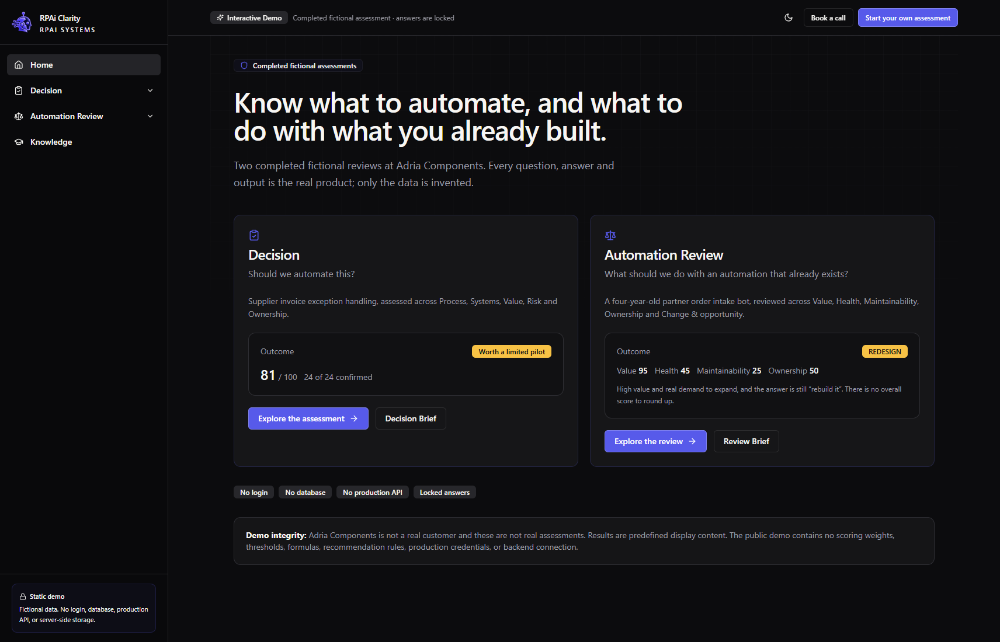
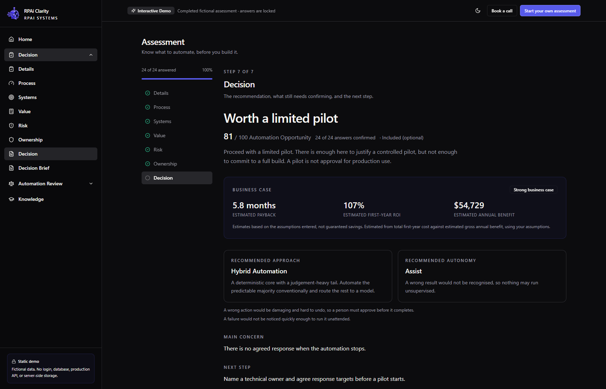
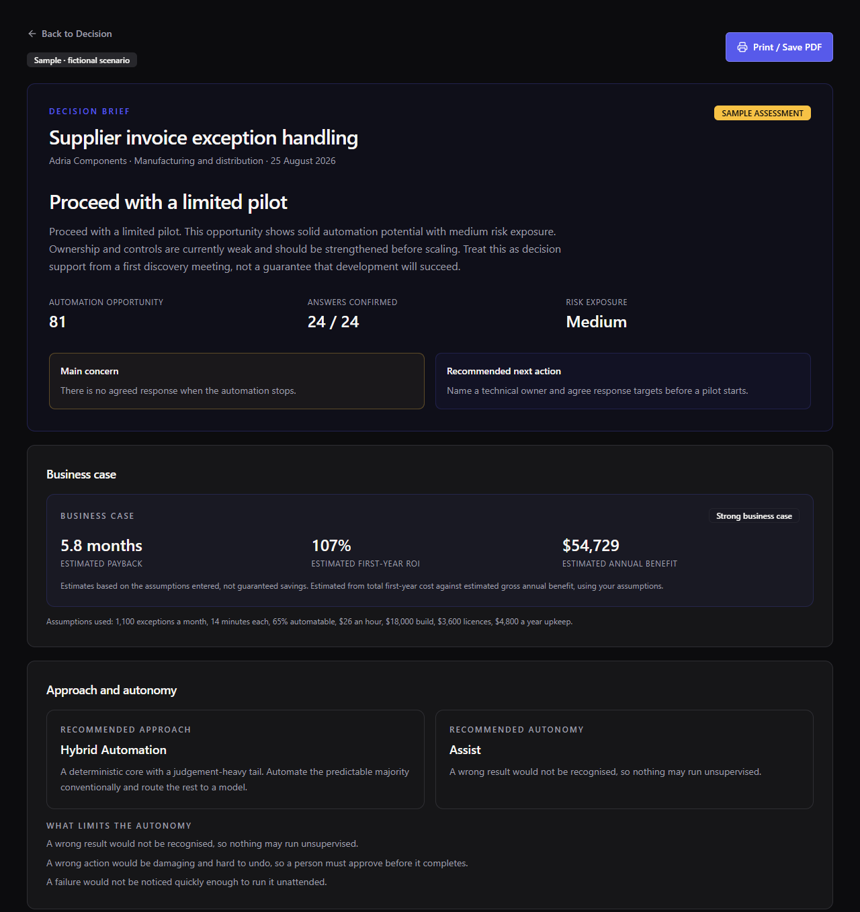
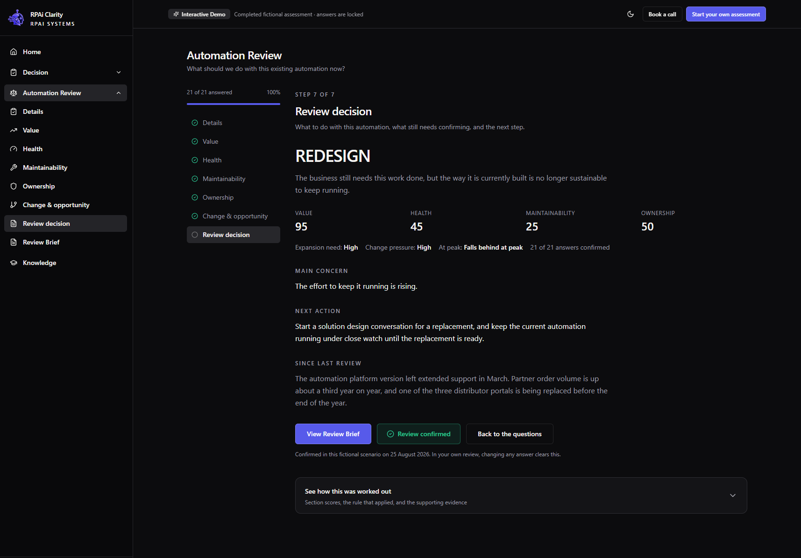
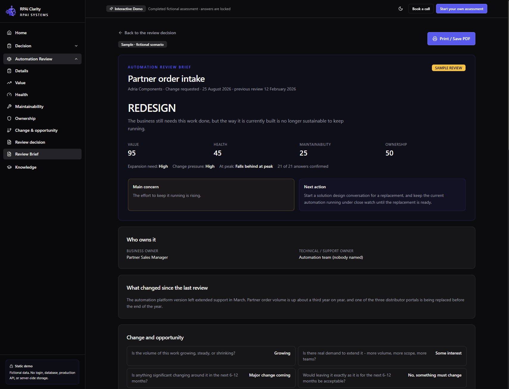

  

<h1 align="center">RPAI Clarity</h1>

  <b>Decision before automation.</b> 
  Know what to automate before you build it — and what to do with the automations you already run.

  <a href="https://demo.rpai.rs/"><b>Try the live demo</b></a> ·
  <a href="https://rpai.rs/">rpai.rs</a> ·
  <a href="#how-it-works">How it works</a> ·
  <a href="#privacy-and-deployment">Privacy &amp; deployment</a>

  

> **Status: private advisor preview.** RPAI Clarity is currently available to selected
> advisor-preview users through [rpai.rs](https://rpai.rs/). The
> [interactive demo](https://demo.rpai.rs/) is open to everyone.

## The problem

Not every process should be automated. The expensive part of automation is rarely
building it — it is discovering, months in, that it was the wrong process to build: the
exceptions dominate, nobody owns it once it runs, or a wrong result would never be
noticed.

Most automation decisions are still made from memory, scattered notes and spreadsheets
after a discovery call, and existing automations are kept, scaled or abandoned on
instinct.

## What Clarity does

RPAI Clarity is a browser-based decision tool for automation teams and consultants. It
turns a first discovery conversation into a structured, evidence-backed decision — while
the conversation is still happening.

It answers two questions:

| | Question | Result |
|---|---|---|
| **Decision** | *Should we automate this?* | A 0–100 Automation Opportunity score, a recommendation, the main concern and the next action — summarised in a **Decision Brief** |
| **Automation Review** | *What should we do with an automation that already exists?* | A lifecycle decision — **Scale, Keep as is, Stabilize, Redesign or Retire** — summarised in a **Review Brief** |

  

> **Human decides. Clarity structures the decision.** Clarity doesn't replace the
> analyst; it gives the analyst a consistent framework for making the call.

## How it works

1. **Assess** — capture the candidate process and business context with the process
   owner, then work through a consistent set of questions instead of relying on memory.
2. **Score** — Clarity turns the answers into a structured 0–100 result immediately and
   shows what is still unconfirmed.
3. **Decide** — review the recommendation, the main concern and the recommended next
   action.
4. **Report** — share the Decision Brief, ready to review, print or save as PDF.

  

## See Clarity in action

A short walkthrough of the Decision and Automation Review flows using the public fictional demo data.

https://github.com/user-attachments/assets/ac9b6194-5bd2-4fb3-94d9-5db948046556

## What the assessment considers

**Decision** — 24 core questions across five dimensions:

| Dimension | What it looks at |
|---|---|
| **Process** | Whether the work can be explained, follows clear rules and stays settled long enough to be worth automating |
| **Systems** | Access, a workable route in, decent information, and systems that are not about to change |
| **Value** | Volume, time saved, and whether it matters to the business right now |
| **Risk** | Data and approval rules, work continuing without it, someone to step in, noticing failures, recognising a wrong result, reversibility, and whether it can be bounded and escalated |
| **Ownership** | Who is responsible once it is running, and what happens on the day it stops |

An optional **Business Case** (volume, effort and cost) adds payback and first-year ROI
estimates; leaving it out does not count against the assessment.

**Automation Review** — 21 core questions across Value, Health, Maintainability,
Ownership, and Change & opportunity.

### Decision logic worth knowing

- **Unknown is not evidence.** Unanswered questions are held at a neutral value and
  counted as unconfirmed — they never masquerade as a final recommendation.
- **Opportunity is technology-independent.** Whether work needs judgement, how messy the
  inputs are, or which integration route exists decide the *approach*, not whether the
  work is worth doing.
- **Approach is a separate recommendation** — deterministic automation, an AI-assisted
  workflow, an AI agent, a hybrid, or leaving it with people. Judgement-heavy work is not
  a worse candidate; it is a different one.
- **Autonomy is gated, not scored** — assist only, execute with approval, bounded
  autonomy or full autonomy. A high opportunity score is never by itself permission to
  run unsupervised.
- **A healthy automation is not automatically a scale candidate.** Automation Review
  keeps value, health and change separate, so a high score in one area cannot outvote an
  unsustainable build — which is why it deliberately has no single overall score.

## Example output

The public demo contains two completed, fictional assessments at *Adria Components*:

**Decision — supplier invoice exception handling.** Outcome: *Proceed with a limited
pilot* — Automation Opportunity 81/100, 24 of 24 answers confirmed, medium risk
exposure. The Decision Brief shows the score, answers confirmed and risk exposure; the main concern (*there is no agreed response when the automation
stops*) paired with a next action; the business case; the recommended approach
(*Hybrid*) and autonomy (*Assist*); the evidence breakdown per dimension; required
actions; and a 30-day decision plan.

  

**Automation Review — a four-year-old partner order intake bot.** Value 95, Health 45,
Maintainability 25, Ownership 50. Outcome: **REDESIGN** — high value and real demand to
expand, but the build is no longer sustainable, so the next action is a solution design
conversation for a replacement.

<table>
  <tr>
    <td align="center"></td>
    <td align="center"></td>
  </tr>
  <tr>
    <td align="center">Review decision</td>
    <td align="center">Review Brief</td>
  </tr>
</table>

Screenshots show fictional demo data. Every question, answer and output in the demo is
the real product; only the data is invented.

## Who it is for

- **Automation teams and CoEs** deciding which candidates deserve attention and which
  existing automations to scale, keep, stabilize, redesign or retire.
- **Automation consultants and advisors** who want to leave a discovery call with a
  defensible recommendation instead of days of follow-up.
- **Process owners and decision owners** who need a clear, evidence-backed brief before
  approving a pilot.

Use Automation Review after a pilot, after go-live, during a scheduled review, or
whenever support cost, demand or change raises a question.

## Privacy and deployment

As stated on [rpai.rs](https://rpai.rs/):

| | |
|---|---|
| **Deployment** | Browser-based — no local installation required |
| **Integration** | None required — works independently of your automation stack |
| **Data** | Session-only assessment data — client operational inputs and report records are not stored server-side by Clarity |
| **Output** | Immediate assessment report, ready for review, print or export |
| **Access** | Controlled, licensed account access |

The public interactive demo is static: fictional data, locked answers, and no login,
database, production API or server-side storage. It contains no scoring weights,
thresholds, formulas or recommendation rules. Demo analytics are optional and
consent-based.

## Try the live demo

**[demo.rpai.rs](https://demo.rpai.rs/)** — walk through every question, the final
recommendation, the Decision Brief and the Automation Review in a locked, fictional
scenario. No login required.

RPAI Clarity is currently in private advisor preview. For access or a guided demo with
one of your own automation candidates, visit **[rpai.rs](https://rpai.rs/)**.

## Feedback

Questions, bugs or ideas? [Open an issue](https://github.com/rimedag/rpai-clarity/issues/new/choose).
Please do not include client names or confidential process details.

## License

RPAI Clarity is **commercial, closed-source software** by RPAI Systems. This repository
contains product information, documentation and artwork only — no source code, scoring
model or recommendation rules. See [LICENSE](LICENSE).

---

Built by <a href="https://rpa.rs/">RPAI Systems</a> · <a href="https://rpai.rs/">rpai.rs</a> · <a href="https://demo.rpai.rs/">Live demo</a>

